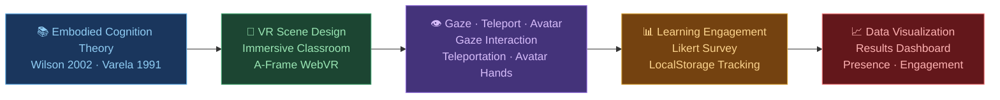
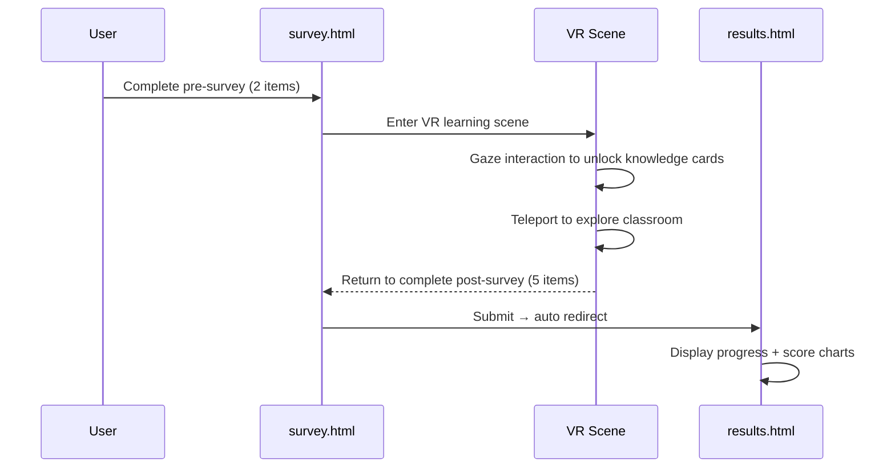

# VR Embodied Learning Scene  
**A WebVR prototype exploring embodied cognition and presence in immersive learning environments**  

🔗 **Live Demo:** https://sara6v6.github.io/vr-embodied-learning/  
📋 **Survey:** https://sara6v6.github.io/vr-embodied-learning/survey.html  
📊 **Results:** https://sara6v6.github.io/vr-embodied-learning/results.html  

---  

## Overview  

This prototype is an exploratory research practice investigating how **body ownership illusion** and **sense of presence** in virtual reality may influence learner engagement and cognitive investment.  

The design is informed by research on VR presence and embodied cognition, particularly work related to:  
- Presence and immersion in virtual environments  
- Embodied cognition and its role in knowledge construction  
- Interactive affordances in VR learning spaces  

---  

## Research Framework  



## User Flow  



---  

## Demo Features  

| Feature | Description |  
|---------|-------------|  
| Immersive Classroom | Virtual classroom with blackboard, desks, chairs, and windows |  
| Gaze Interaction | Look at a colored sphere for 2 seconds to reveal a knowledge card |  
| Teleportation | Click anywhere on the floor to move to that position |  
| Avatar Hands | Virtual hands visible in first-person view (body ownership) |  
| 5 Knowledge Cards | Embodied Cognition · Presence · Body Ownership · Engagement · Research Design |  
| Ambient Audio | Background audio loop to enhance sense of presence |  
| Learning Progress | localStorage-based tracking of visited cards, displayed on HUD |  
| Pre/Post Survey | 7-point Likert scale measuring presence and learning engagement |  
| Results Dashboard | Chart.js visualization of survey scores and exploration data |  

---  

## Research Background  

The prototype is inspired by studies on **tele-existence**, **pseudo-embodiment**, and **presence engineering** in XR environments. The central question guiding this exploration:  

> *How does the sense of "being there" and bodily presence in a virtual space alter the quality of cognitive engagement during learning tasks?*  

This question connects educational technology with affective computing and human augmentation — the core intersection I aim to investigate at the graduate level.  

---  

## Technology  

- **[A-Frame](https://aframe.io/)** (WebVR framework, v1.5.0)  
- **Chart.js** (data visualization)  
- localStorage API (client-side progress and survey data)  
- Runs directly in browser — no installation required  
- Mobile compatible (Google Cardboard supported)  

---  

## How to Experience  

1. Open **survey.html** and complete the pre-survey  
2. Click the link to enter the VR scene  
3. Use **WASD** to move, **mouse** to look around  
4. **Gaze** at colored spheres for 2 seconds to open knowledge cards  
5. **Click** on the floor to teleport  
6. Return to survey.html and complete the post-survey  
7. View your results in **results.html**  

---  

## Repository Structure  

```
vr-embodied-learning/
├── index.html      — VR learning scene (A-Frame)
├── survey.html     — Pre/post Likert survey
├── results.html    — Data visualization dashboard
└── README.md
```  

---  

## Author  

**Xiala Dilimulati (夏拉·迪力木拉提)**  
B.S. Educational Technology, Shanghai Normal University  
Research interest: VR presence, embodied learning, human-computer interaction  

---  

## Acknowledgements  

Built with [A-Frame](https://aframe.io/) by Mozilla and [Chart.js](https://www.chartjs.org/). Concept developed as part of graduate school application research exploration.  
